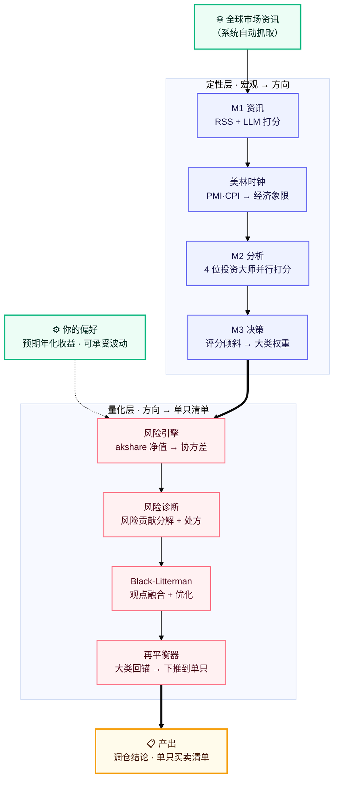

# macro-allocation · 个人多资产配置决策系统

> 你设定**对收益与风险的偏好**（预期年化收益、可承受波动率），系统**自动抓取近期全球市场资讯**，输出"该买什么、各买多少"的**再平衡建议**。
>
> *You set your return/risk preferences; the system pulls recent global market news and outputs a concrete rebalancing plan.*


> ⚠️ **免责声明**：本仓库所有数据均为**示例假数据**，仅用于演示系统运行；所有产出为研究/工程演示，**不构成任何投资建议**。

---

## 这个系统解决什么问题

从"凭感觉调仓"升级为"**系统化、可回溯、有据可依**"的配置决策。一条命令，把下面这套流程跑完：

- 📰 **读懂宏观**：自动抓取全球资讯 + 美林时钟定位经济象限（复苏/过热/滞胀/衰退）
- 🧠 **多视角研判**：4 位投资大师（达利欧 / 霍华德·马克斯 / 巴菲特 / 索罗斯）人格并行打分，综合成方向观点
- ⚖️ **量化配置**：风险引擎 + Black-Litterman，结合你的收益/风险偏好把观点转成大类权重
- 🧩 **多维分散**：在**资产类型**（股 / 债 / 商品 / 黄金）、**地域**（美 / 中 / 亚太…）、**行业 / 赛道**三个维度上分散——分散是降波动的根基
- 🎯 **降低风险集中**：诊断"假分散"，识别**股票的风险贡献过于集中**并把它降下来（核心目标）
- 🛰️ **个股卫星仓**：主题 → 产业链环节 → 标的的三级漏斗选股，研报驱动验证
- 🧾 **落到可执行**：输出"**买卖哪只基金、各多少万**"的精确调仓清单

---

## 系统架构

季度运行，两段式流水线：**定性层（宏观→方向）→ 量化层（方向→权重→单只清单）**。



### 模块清单

**定性层（宏观 → 方向）**
| 模块 | 职责 |
|---|---|
| `m1_news/` | 抓 12 个 RSS 源 + LLM 打分，产出宏观简报 |
| `clock/` | 美林时钟——用 PMI/CPI 定位经济象限，注入大师背景 |
| `m2_analysis/` | 4 位投资大师人格并行打分（self-consistency 中位数投票稳定输出） |
| `m3_decision/` | 纯逻辑：等权基准 + 评分倾斜 → 二级权重 |
| `theme_decider/` | 把方向观点翻译成"选基/选股主题" |

**量化层（方向 → 权重 → 单只清单）**
| 模块 | 职责 |
|---|---|
| `risk_engine/` | akshare 历史净值 → 年化波动 + Ledoit-Wolf 收缩协方差 |
| `diagnostic/` | 算各大类**风险贡献占比**，识别"假分散"，给无杠杆处方 |
| `black_litterman/` | 把大师评分作观点融合先验 → 后验收益 → 均值方差优化 |
| `style_tilt/` | 低波红利替换（RBSA 收益回归验真，**绝不靠基金名字**判断风格） |
| `vol_target/` | 波动率目标——动态削峰，波动飙升机械减仓 |
| `rebalancer/` · `fund_rebalancer/` | 大类再平衡 → **下推到"买卖哪只基金各多少万"** |
| `fund_selector/` | 券商分析师式选基：主题召回 → 硬筛 → 风格验真 → 打分排序 |
| `holdings_screener/` | 持仓末位淘汰——同类内按复合质量标准做组合新陈代谢 |

**个股卫星仓（A 股）**
| 模块 | 职责 |
|---|---|
| `stock_selector/` | **个股选择**：主题 → **产业链发现 → 环节排序 → 分析师四步法** → 选标的小篮子（仅 A 股、仅建议） |
| `report_fetcher/` | **研报驱动选股**：抓研报 → 双门精筛 → 产出"决策弹药卡"（投资逻辑 / 假设体检 / 认知差 / 估值 / 跟踪） |

**工具 / 验证**
| 模块 | 职责 |
|---|---|
| `portfolio_monitor/` | 持仓周报监控：按净值算每日涨跌、出周报 |
| `backtest/` | 用长历史指数（含 2008/2018/2022 熊市）验证"降风险"做法 |

---

## 快速开始

```bash
# 1. 装依赖（用 uv）
python -m uv sync

# 2. 准备持仓配置（用自带示例假数据，零隐私即可跑通）
cp config/holdings.example.yaml config/holdings.yaml
cp config/holdings_current.example.json config/holdings_current.json

# 3. 填 API key（M1/M2 用 DeepSeek）
cp .env.example .env   # 然后把 DEEPSEEK_API_KEY 填进去

# 4. 跑全流程
python -m uv run python main.py
```

---

## 常用命令

```bash
python -m uv run python main.py                 # 两段式全流程（定性 + 量化）
python -m uv run python main.py --qual-only     # 只跑定性 M1→M2→M3
python -m uv run python main.py --quant-only    # 只跑量化层（省 API）

# 单模块
python -m uv run python -m clock                # 美林时钟
python -m uv run python -m diagnostic           # 风险贡献诊断
python -m uv run python -m fund_rebalancer      # 单只基金调仓清单
python -m uv run python -m fund_selector 红利低波    # 选基
python -m uv run python -m stock_selector       # 个股选择（卫星仓）
python -m uv run python -m backtest --multi     # 多区间深熊回测
```

---

## 示例输出（示例假数据）

风险诊断——看清"假分散"（数字为示例）：

```
大类风险贡献诊断（示例）
  股票   资金占比 40%   风险贡献偏高 ⚠️ 风险高度集中
  债券   资金占比 25%   风险贡献很低
  商品   资金占比  9%   风险贡献中等
处方：①股票内低波替换 ②加 3% 黄金 → 股票风险贡献显著下降 ✅
```

单只调仓清单：

```
再平衡建议（示例 · 总资产 100w）
  卖出  国泰纳斯达克ETF(513100)   -2.0w   （股票超配，低波替换）
  买入  景顺长城红利低波(007751)  +2.0w
  买入  招商招悦纯债A(003156)     +3.0w   （债券低配，回补）
```

---

## 方法亮点

1. **三维分散是配置的根基**：组合在 ① **资产类型**（股 / 债 / 商品 / 黄金）② **地域**（美 / 中 / 亚太等）③ **行业 / 赛道** 三个维度上分散——用弱相关/负相关资产降低组合整体波动、提升风险收益比。诊断与再平衡都围绕"**让分散真正生效（破"假分散"）**"展开。
2. **"降低股票风险贡献"全链闭环**：诊断 → 处方（低波替换 + 加黄金）→ 用真实协方差逐级求解，**显著降低股票的风险贡献占比、让组合更均衡**。
3. **风格验真绝不靠名字**：用 RBSA 收益回归 + 看穿持仓交叉验证基金真实风格，剔除"名不副实"的标的。
4. **三级漏斗选个股**：主题 → 产业链环节 → 标的，先定位"哪个环节最值得挖"，再回到具体个股，研报交叉验证。
5. **可执行到单只**：不止给大类比例，直接产出"买卖哪只、各多少万"的清单。

---

## 配置

- `config/settings.yaml`：方向定义、设计参数（步长/偏离上限）、BL/波动目标/再平衡参数
- `config/holdings.example.yaml`：SAA 锚 + 代表基金 + sleeve（**复制为 `holdings.yaml` 使用**）
- `.env`：DeepSeek API key（见 `.env.example`）

---

## 路线图

- [x] 定性层 M1→M2→M3 + 美林时钟
- [x] 量化层 V2：风险引擎 / 诊断 / Black-Litterman / 再平衡
- [x] 降股票风险处方（低波替换 + 波动目标）+ 多区间回测
- [x] fund-level 再平衡（精确单只清单）+ 选基模块
- [x] 个股选择（产业链三级漏斗 + 研报驱动）
- [ ] 虚拟货币等高风险类（规划中）

---

## 技术栈

Python 3.13 · akshare · pandas / numpy · scikit-learn（Ledoit-Wolf）· PyPortfolioOpt（Black-Litterman）· DeepSeek（LLM）· uv

---

## 声明

仅作个人投资工具的框架展示，**不构成任何投资建议**；所有数据均为示例假数据。
